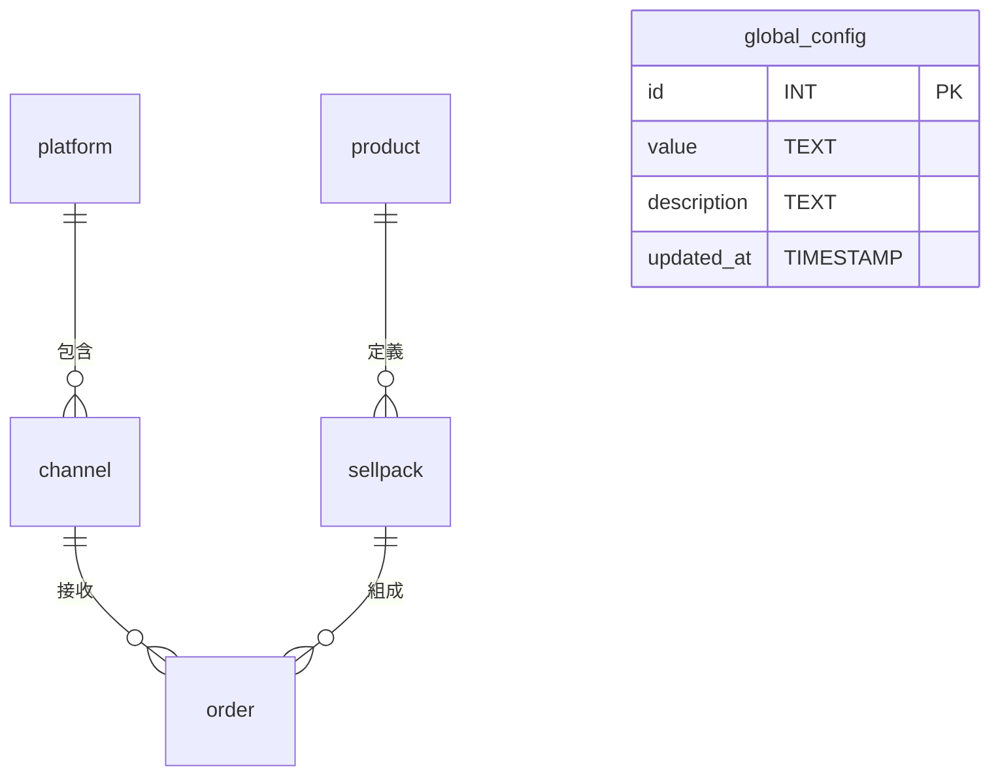

# 📦 PostgreSQL 資料庫結構定義（含約束與分區）

本初始架構包含 5 張核心資料表：

- `platform`：電商平台主檔
- `channel`：平台下的銷售通路
- `product`：商品主檔
- `sellpack`：商品可銷售單位（例如組合包）
- `order`：訂單資料（依訂單日期做分區）
- `global_config`：系統設定表

---

## 🧱 資料表：`platform`

| 欄位名稱     | 類型         | 可為 NULL | 說明與約束                     |
|--------------|--------------|------------|--------------------------------|
| id           | VARCHAR(20)       | 否         | 主鍵 PRIMARY KEY               |
| name         | VARCHAR(50)  | 否         | 平台名稱                       |
| code         | VARCHAR(20)  | 否         | 唯一平台代碼，唯一值 [INDEX]  |
| created_at   | TIMESTAMP    | 否         | 建立時間，預設為 NOW()        |

---

## 🧱 資料表：`channel`

| 欄位名稱     | 類型         | 可為 NULL | 說明與約束                               |
|--------------|--------------|------------|------------------------------------------|
| id           | VARCHAR(20)       | 否         | 主鍵 PRIMARY KEY                         |
| platform_id  | VARCHAR(20)          | 否         | 外鍵，對應 `platform(id)`，[INDEX]       |
| name         | VARCHAR(50)  | 否         | 通路名稱                                 |
| code         | VARCHAR(20)  | 否         | 通路代碼，在相同平台下需唯一 [INDEX]     |
| created_at   | TIMESTAMP    | 否         | 建立時間，預設為 NOW()                   |

---

## 🧱 資料表：`product`

| 欄位名稱     | 類型          | 可為 NULL | 說明與約束                    |
|--------------|---------------|------------|-------------------------------|
| id           | VARCHAR(20)        | 否         | 主鍵 PRIMARY KEY              |
| sku          | VARCHAR(30)   | 否         | 商品 SKU，唯一值 [INDEX]     |
| name         | VARCHAR(100)  | 否         | 商品名稱                      |
| description  | TEXT          | 是         | 商品說明                      |
| created_at   | TIMESTAMP     | 否         | 建立時間，預設為 NOW()       |

---

## 🧱 資料表：`sellpack`

| 欄位名稱     | 類型          | 可為 NULL | 說明與約束                                   |
|--------------|---------------|------------|----------------------------------------------|
| id           | VARCHAR(20)        | 否         | 主鍵 PRIMARY KEY                             |
| product_id   | VARCHAR(20)           | 否         | 外鍵，對應 `product(id)`，[INDEX]            |
| code         | VARCHAR(30)   | 否         | 對外銷售代碼（如條碼），每個商品唯一 [INDEX] |
| pack_name    | VARCHAR(50)   | 否         | 包裝名稱（如單入、三入）                     |
| price        | NUMERIC(10,2) | 否         | 售價                                         |
| created_at   | TIMESTAMP     | 否         | 建立時間，預設為 NOW()                       |

---

## 🧱 資料表：`order`（依 `order_date` 分區）

| 欄位名稱     | 類型          | 可為 NULL | 說明與約束                                          |
|--------------|---------------|------------|-----------------------------------------------------|
| id           | VARCHAR(20)        | 否         | 主鍵 PRIMARY KEY                                    |
| order_no     | VARCHAR(40)   | 否         | 訂單編號 [INDEX]，與 `sellpack_id` 應唯一組合       |
| channel_id   | VARCHAR(20)           | 否         | 外鍵，對應 `channel(id)`，[INDEX]                   |
| product_id  | VARCHAR(20)           | 是         | 外鍵，對應 `product(id)`，[INDEX]                  |
| sellpack_id  | VARCHAR(20)           | 是         | 外鍵，對應 `sellpack(id)`，[INDEX]                  |
| quantity     | INT           | 否         | 購買數量                                            |
| total_amount | NUMERIC(12,2) | 否         | 訂單金額                                            |
| order_date   | DATE          | 否         | 訂單日期（分區鍵）[PARTITION KEY]，[INDEX]         |
| created_at   | TIMESTAMP     | 否         | 建立時間，預設為 NOW()                              |

> ⚠️ 此表建議使用 `PARTITION BY RANGE (order_date)` 建立，依月份或年度進行分區，有效提升查詢效率。

---

## 🧱 資料表：`global_config`

| 欄位名稱     | 類型          | 可為 NULL | 說明與約束                                   |
|--------------|---------------|------------|----------------------------------------------|
| id           | VARCHAR(20)        | 否         | 主鍵 PRIMARY KEY                             |
| value        | TEXT          | 否         | 設定值         |
| description         | TEXT   | 是         | 說明此設定用途 |
| updated_at   | TIMESTAMP     | 否         | 建立時間，預設為 NOW()                       |

---
## 🔗 ER 圖關係

