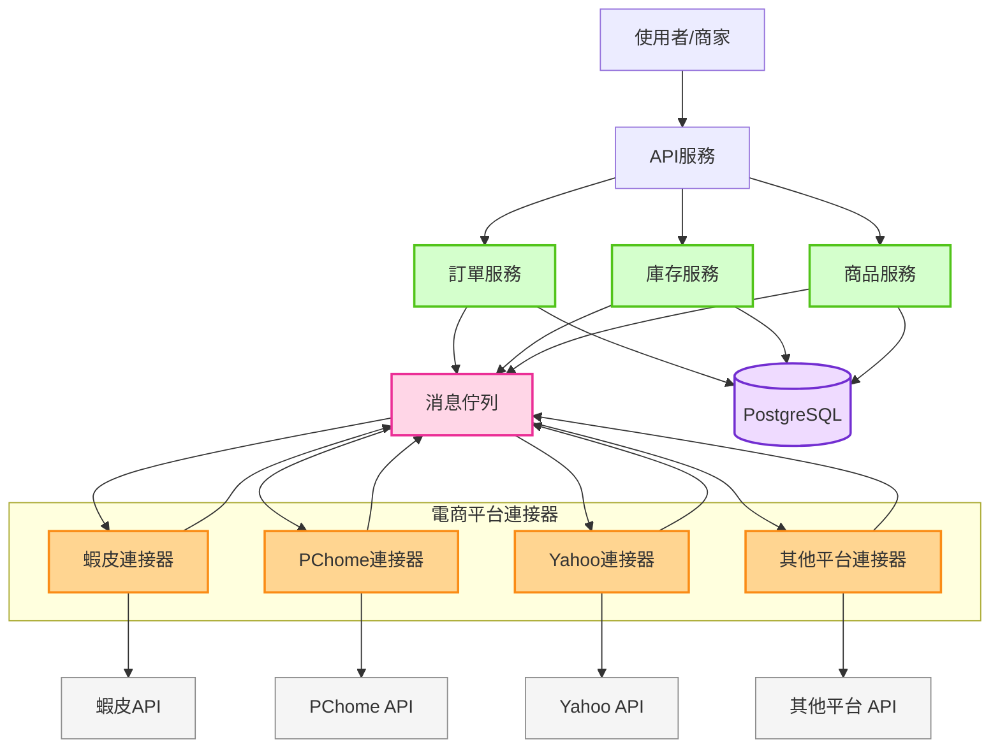

```mermaid
flowchart TB
    User[使用者/商家] --> API[API服務]
    API --> OrderService[訂單服務]
    API --> InventoryService[庫存服務]
    API --> ProductService[商品服務]
    
    subgraph Connectors[電商平台連接器]
        Shopee[蝦皮連接器]
        PChome[PChome連接器]
        Yahoo[Yahoo連接器]
        Others[其他平台連接器]
    end
    
    OrderService --> Kafka[消息佇列]
    InventoryService --> Kafka
    ProductService --> Kafka
    
    Kafka --> Shopee
    Kafka --> PChome
    Kafka --> Yahoo
    Kafka --> Others
    
    Shopee --> ShopeeAPI[蝦皮API]
    PChome --> PChomeAPI[PChome API]
    Yahoo --> YahooAPI[Yahoo API]
    Others --> OtherAPIs[其他平台 API]
    
    Shopee --> Kafka
    PChome --> Kafka
    Yahoo --> Kafka
    Others --> Kafka
    
    OrderService --> DB[(PostgreSQL)]
    InventoryService --> DB
    ProductService --> DB
    
    classDef service fill:#d4ffcc,stroke:#52c41a,stroke-width:2px
    classDef connector fill:#ffd591,stroke:#fa8c16,stroke-width:2px
    classDef external fill:#f5f5f5,stroke:#8c8c8c,stroke-width:1px
    classDef database fill:#efdbff,stroke:#722ed1,stroke-width:2px
    classDef messaging fill:#ffd6e7,stroke:#eb2f96,stroke-width:2px
    
    class OrderService,InventoryService,ProductService service
    class Shopee,PChome,Yahoo,Others connector
    class ShopeeAPI,PChomeAPI,YahooAPI,OtherAPIs external
    class DB database
    class Kafka messaging
	
```