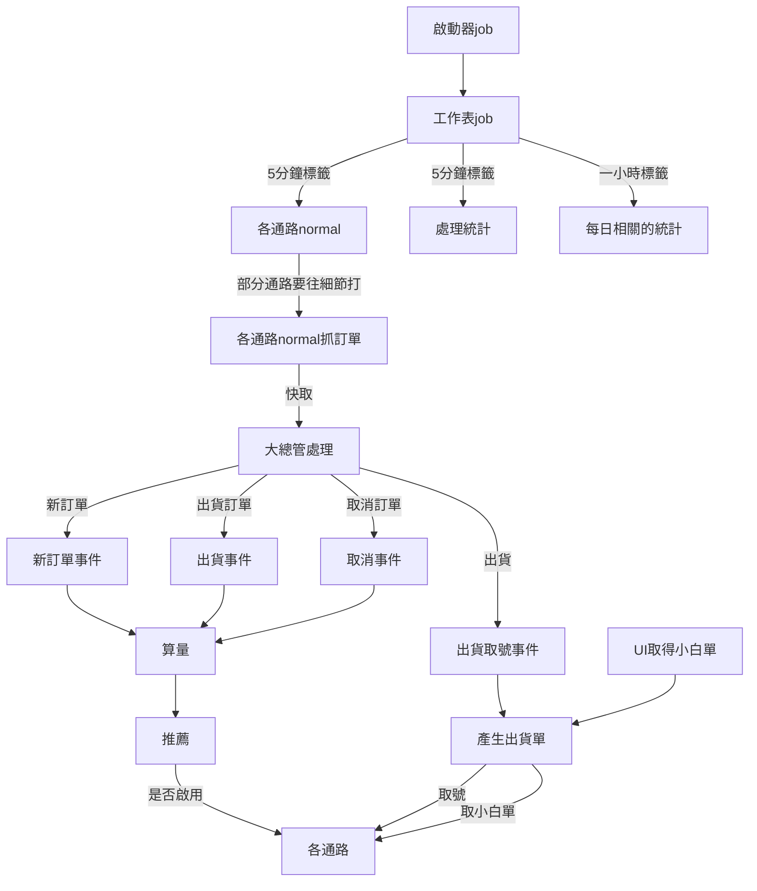

```mermaid
flowchart TD
 啟動器job --> 工作表job
 
 工作表job --5分鐘標籤--> 各通路normal
 工作表job --5分鐘標籤--> 處理統計
 工作表job --一小時標籤--> 每日相關的統計
 
 各通路normal--部分通路要往細節打--> 各通路normal抓訂單
 各通路normal抓訂單 --快取-->大總管處理
 
 大總管處理 --新訂單-->新訂單事件
 大總管處理 --出貨訂單-->出貨事件
 大總管處理 --取消訂單-->取消事件
 大總管處理 --出貨-->出貨取號事件
 
 新訂單事件 -->算量
 出貨事件 -->算量
 取消事件 -->算量
 算量 -->推薦
 推薦 --是否啟用--> 各通路
 
出貨取號事件 -->產生出貨單
產生出貨單 --取號-->各通路

UI取得小白單 -->產生出貨單
產生出貨單 --取小白單-->各通路
```
