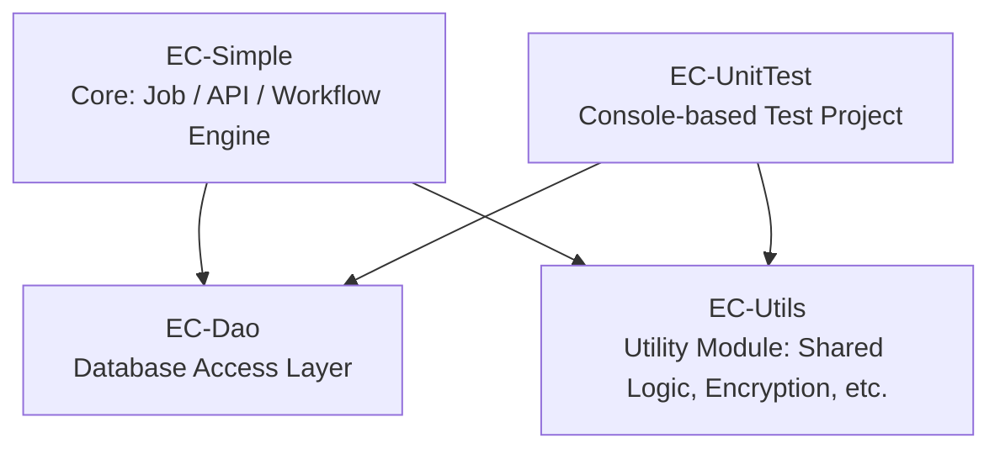

# EC-Simple System Overview

This project is an e-commerce backend processing framework, including data access, background job handling, utility modules, and unit testing. The architecture is modular for better maintainability and scalability.

---

## 🧩 Project Structure

EC-Simple.sln 
├── EC-Simple # Core service: Job / API orchestration and execution 
│ └── References: EC-Dao, EC-Utils 
├── EC-Dao # Data access layer module, abstracts DB interaction logic 
├── EC-Utils # Utility module, provides helper functions and services 
├── EC-UnitTest # Unit testing project, built on a console app structure

---

## 📦 Project Descriptions

### `EC-Simple`
- Core service application, including:
  - Job scheduling and management
  - Dynamic job registration and execution
  - External API integration logic
- All workflows are dependency-injected and controlled by configuration or environment variables.

### `EC-Dao`
- Handles all data access operations.
- Encapsulates database connections and queries.
- Follows the Repository Pattern for consistency.

### `EC-Utils`
- Shared utility library.
- Provides commonly used helpers, such as:
  - Encryption/decryption tools
  - File handling
  - Configuration parsing/conversion
  - Time and formatting utilities

### `EC-UnitTest`
- Console-based unit testing project.
- Can be executed independently to validate individual Jobs or features.
- Useful for local testing and rapid development verification.

---

## 🚀 Getting Started

### Running `EC-Simple`

1. Set the `JobToRun` environment variable or modify `appsettings.json`
2. Run the project using .NET CLI or Visual Studio:

   ```bash
   dotnet run --project EC-Simple

## ⚙️ Environment
* .NET 8
* Recommended IDEs:
    * Visual Studio 2022
    * VS Code

Suggested tools:
* Docker (optional, for database containers)
* GitLab + Jenkins (CI/CD integration)

## Project Dependencies
